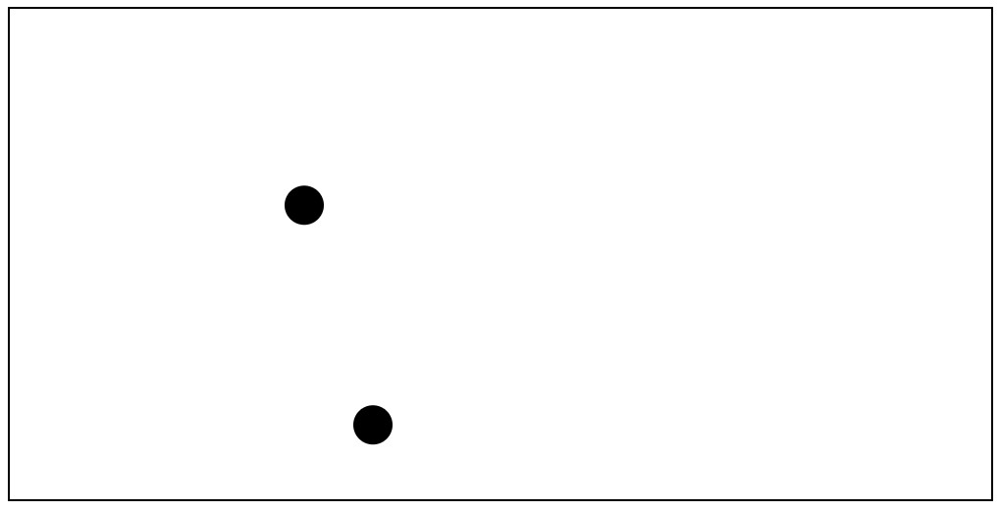

## Simulation de Choc entre Deux Particules

# Description

Ce projet est une simulation simple d’un choc mécanique entre deux particules circulaires en mouvement.
L’animation utilise HTML5 Canvas et JavaScript pour représenter le déplacement, la gravité et les collisions.

**Voir le projet en ligne :** [Simulation Choc Mécanique](https://majjati-mohammed.github.io/Simulation_simple_du_choc_mecanique/)

---

# Objectif

Simuler le comportement de deux particules soumises à :

- la vitesse initiale

- la gravité

- les rebonds contre les bords

- les collisions entre particules

---

# Technologies

- HTML5 Canvas

- JavaScript

- requestAnimationFrame

